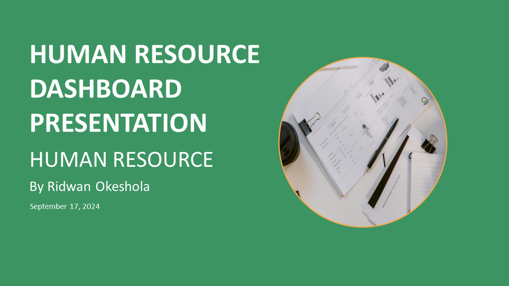
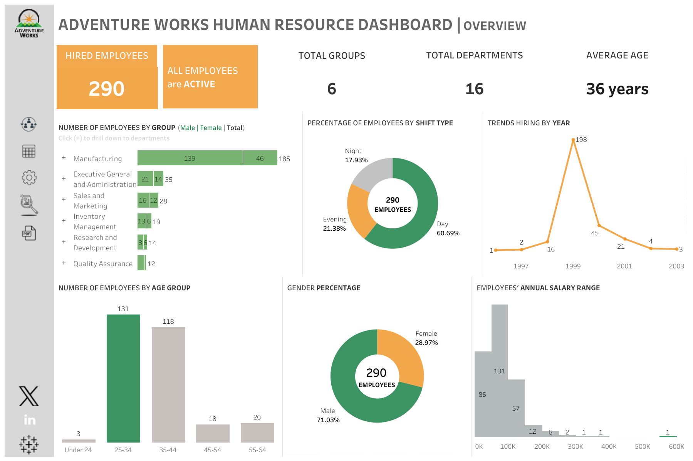
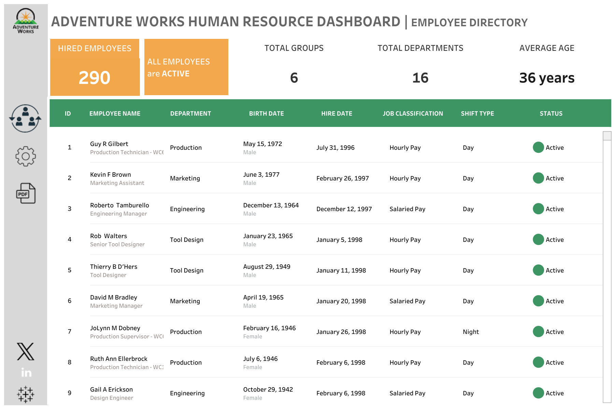
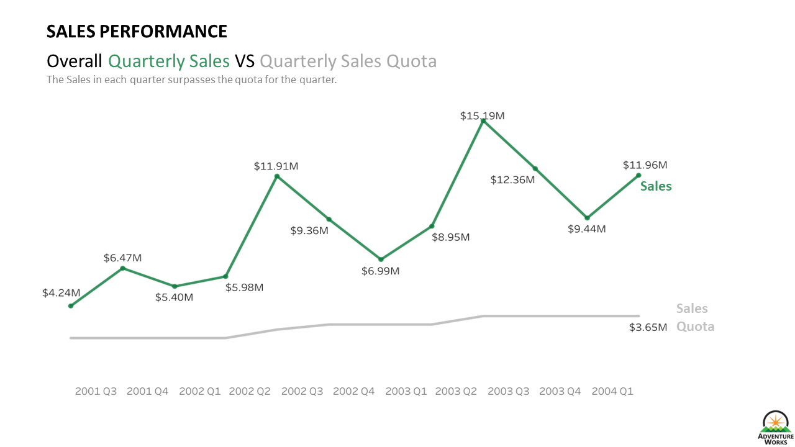
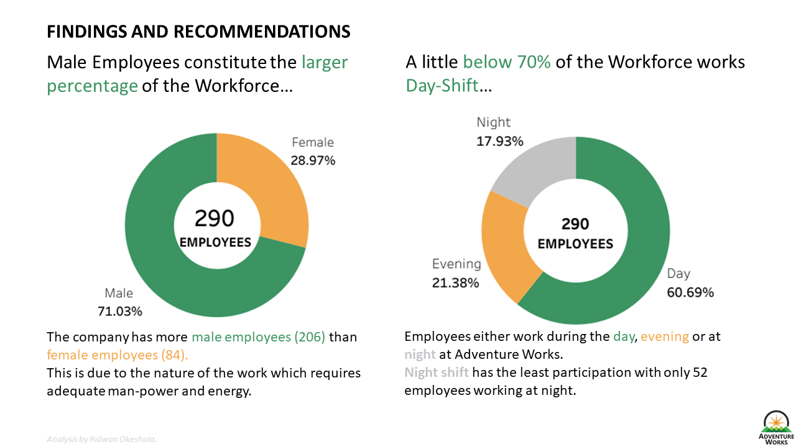

# Adventure Works Human Resource Dashboard
## Overview

This project focuses on analyzing the **Human Resources (HR)** data of **Adventure Works**, a multinational manufacturing company. The HR dashboards were designed to be presented to both the **HR Department** and **Executive Leadership** to provide insights into employee demographics, sales performance, hiring trends, and workforce management.

This project was created using data from the Adventure Works database, focusing on key metrics to help stakeholders make informed decisions. The dashboards were built using **Tableau** and presented in PowerPoint.

You can interact with the Tableau Dashboard [here](https://public.tableau.com/views/HumanResourceDashboard_17250579779890/HR?:language=en-US&:sid=&:redirect=auth&:display_count=n&:origin=viz_share_link)

---

## Table of Contents
- [Introduction](#introduction)
- [Problem Statement](#problem-statement)
- [Skills Demonstrated](#skills-demonstrated)
- [Data Sourcing](#data-sourcing)
- [Data Transformation](#data-transformation)
- [Data Modelling](#data-modelling)
- [Analysis and Visualizations](#analysis-and-visualizations)
- [Conclusions and Recommendations](#conclusions-and-recommendations)
- [Screenshots](#screenshots)

---

## Introduction

Adventure Works is a multinational company involved in the manufacturing and sales of bicycles and cycling accessories. This project specifically focuses on its **HR data** across multiple departments and groups within the company. 

The analysis covered:
- Workforce demographics
- Sales performance
- Hiring trends
- Employee shifts and department transfers
- Compensation and workforce productivity

The dashboards were tailored to meet the needs of **HR personnel** and **executive leaders** by offering actionable insights based on key performance indicators (KPIs).

---

## Problem Statement

Adventure Works experienced rapid growth, hiring over 200 employees between 1998 and 1999. The company requires a deep understanding of its HR metrics to optimize employee performance, identify areas for improvement, and ensure efficient workforce management.

The following key issues were addressed:
1. Understanding gender distribution across departments.
2. Tracking the performance of sales personnel against sales quotas.
3. Analyzing workforce age demographics and its impact on company growth.
4. Identifying key trends in hiring and internal employee transfers.

---

## Skills Demonstrated

This project showcases the following skills:
- **Data Analysis**: Thorough analysis of HR metrics to derive insights for decision-making.
- **Dashboard Design (Tableau)**: Creating interactive and visually appealing dashboards.
- **Presentation**: Communicating insights effectively to different stakeholders.
- **Data Modelling**: Organizing and transforming raw data for visualization.
- **Storytelling with Data**: Presenting complex data in an easy-to-understand format.

---

## Data Sourcing

The data used in this project was sourced from the **Adventure Works database**, which is a sample dataset used for educational and training purposes in analytics. It contains detailed information on employees, departments, and sales.

The primary data sets included:
- **Employee Information**: Age, gender, department, and work shift details.
- **Sales Data**: Performance metrics for sales employees across various time periods.
- **Hiring Data**: Historical data on employee hires and transfers.

---

## Data Transformation

The raw data required significant transformation to become analysis-ready. Key transformations included:
- **Data Cleaning**: Handling missing values and ensuring data consistency.
- **Date Manipulation**: Parsing dates for hiring and transfer records.
- **Aggregations**: Summarizing sales data by employee, quarter, and department.

---

## Data Modelling

The data model was structured to link:
- **Employee** details with their respective **departments** and **performance**.
- **Sales records** with employee demographics to assess performance by age and gender.

The relational model allowed the analysis of sales performance in the context of employee attributes and organizational structure.

---

## Analysis and Visualizations

### HR Dashboard for Executive Leadership
This dashboard provides a high-level overview of the company's workforce, including:
- **Total Employees**: 290 employees across 16 departments.
- **Employee Demographics**: Gender distribution and age breakdown.
- **Hiring Trends**: Highest hiring occurred in 1999, with 198 new employees added.
- **Departmental Distribution**: 64% of employees are in the Manufacturing Group.
- **Work Shift Distribution**: The majority of employees work the day shift.

You can access the full presentation [here](https://docs.google.com/presentation/d/1UAhoSni0i4b0Hq3CGPeyjSrK3lPO6du2/edit?usp=sharing&ouid=102304971217650512121&rtpof=true&sd=true)

### HR Dashboard for the HR Department
This dashboard drills down into the sales performance of employees in the Sales Department:
- **Total Sales**: $108.27 million from 17 salespersons.
- **Top Performers**: Linda C Mitchell, Jilian Carson, and Michael G Blythe led sales with over $12 million each.
- **Quota vs Sales**: Only two employees failed to meet sales quotas in specific quarters.
- **Sales by Gender**: Analysis of the performance of male and female salespersons.

You can access the full presentation [here](https://docs.google.com/presentation/d/1KZZ7TsGDQXP89qZ2PbG-E3Suzh-R5KBg/edit?usp=sharing&ouid=102304971217650512121&rtpof=true&sd=true)

---

## Conclusions and Recommendations

### Conclusions
- **Sales Performance**: The majority of sales personnel consistently surpassed their sales quotas. However, two salespersons fell short in specific quarters, which indicates the need for targeted performance improvement programs.
- **Demographics**: The workforce is predominantly young, with over 87% of employees falling between the ages of 25-44, presenting strong growth potential for the company.
- **Gender Imbalance**: There are significantly more male employees, especially in labor-intensive departments like Manufacturing. This highlights an opportunity for gender diversity initiatives.

### Recommendations
1. **Improve Sales Training**: Provide additional support and training to underperforming sales staff to help them meet their targets.
2. **Diversify Hiring**: Focus on increasing the representation of female employees, particularly in leadership roles and in departments dominated by males.
3. **Employee Retention Strategy**: Maintain the 0% attrition rate by offering continuous learning and growth opportunities, especially through internal mobility programs.

---

## Screenshots

Here are some key screenshots from the presentation:

### Overview

|       HR Overview
|  :----------------------------------------:
|          

### Employee Directory

|       Employee Directory
|  :----------------------------------------:
|          

### Executive Leadership Dashboard

Sales Performance
:----------------------------------------: 

### HR Dashboard

|        Findings Recommendations
|  :----------------------------------------:
|          

---

